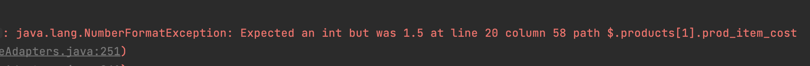
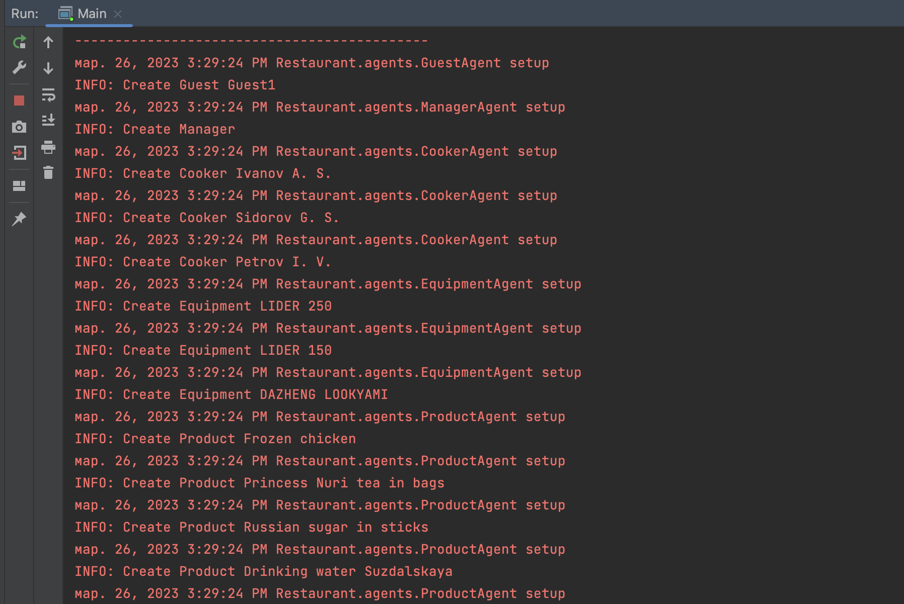

# ДЗ-III Лазарев Василий и Ефимов Иван
## Условие задачи
```
Тут должно было быть условие, но обойдемся без 30 страниц в readme файле
```
##### Планируемая оценка: ~7-9

## Решение:
### Критерии на оценку 4:
```
Корректная ООП-реализация программы без поддержки параллелизма
в процессах и реализации функционала оценки времени 
ожидания заказов, а также без проверки корректности входных 
данных.
```
В директории 'Restaurant' находятся все модели (классы) к задаче. В src
остается лишь точка входа в программу, класс Main, также главный агент, парсер данных
и класс для вывода результатов. Входные данные, т.e. json'ы, расположены в папке
input. 

Выходные данные (логи) можно увидеть в log.json, который автоматически создается 
логгером. 

Все необходимые jar файлы лежат в lib.
### Многопоточность (+1)
Parser.java:
```Java
ExecutorService executor = Executors.newFixedThreadPool(8);
List<Callable<Void>> tasks = new ArrayList<>();
tasks.add(() -> {
    getCookersJson();
    return null;
});
tasks.add(() -> {
    getDishesCardsJson();
    return null;
});
try {
    List<Future<Void>> futures = executor.invokeAll(tasks);
    for (Future<Void> future : futures) {
        future.get();
    }
} catch (InterruptedException | ExecutionException e) {
    e.printStackTrace();
} finally {
    executor.shutdown();
}
```
Для работы с многопоточностью используем ExecutorService и Future.
ExecutorService - это интерфейс, который представляет сервис выполнения потоков. Он предоставляет способ запускать потоки асинхронно и управлять их выполнением.

Future - это интерфейс, который представляет результат асинхронной операции, которая может еще не завершена. Он предоставляет методы для проверки статуса операции и получения результата, когда операция завершится.

В примере выше с парсингом мы можем использовать 
ExecutorService для создания пула потоков, которые будут 
параллельно парсить различные файлы. Мы можем использовать 
метод submit() для отправки каждой задачи на выполнение в пуле 
потоков. Затем мы можем получать объекты Future для каждой 
задачи, чтобы проверять их статус и получать результаты, 
когда они будут готовы.

### Обработка ошибок при обработке входных данных (+1)
```java
Path path = Paths.get("input/equipment.txt");
try {
      EquipmentList equipmentList = new Gson()
      .fromJson(new String(Files.readAllBytes(path)), 
      EquipmentList.class );
      System.out.println(equipmentList);
} catch(IOException e) {
      e.printStackTrace();
      System.out.println(e.getMessage());
}
```
В случае, если что-то идет не так - ловится исключение и выводится ошибка на экран

Например:

### Для МАС используется Jade. Jar файлы Jade, Gson и тд расположены в static (+1)

### Используется паттерн компоновщик (+1)
Есть Product.java и ProductList.java которые реализуют интерфейс IProductComponent
```java
public interface IProductComponent {
    String getName();
    Integer getId();
    Boolean isFood();
    Integer getQuantity();
    void updateQuantity(Integer new_quantity);
    void pickUp(int count);
}
```
Теперь мы можем использовать ProductsList для хранения как листовых элементов Product, так и других экземпляров ProductsList. Мы можем добавлять и удалять элементы как из ProductsList, так и из вложенных ProductsList.

### Используется паттерн Singleton (+1)
Так как меню у нас одно (было бы странно если для каждого гостя отдельное меню) то можно использовать
паттерн Singleton. Благодаря ему, у нас не произойдет ситуации когда в программе существует более одного меню.

```java
public class Menu {
    private static Menu instance_;
    private ArrayList<DishCard> list_;

    private Menu(ArrayList<DishCard> list) {
        list_ = list;
    }

    public static Menu getInstance(ArrayList<DishCard> list) {
        if (instance_ == null) {
            instance_ = new Menu(list);
        } else {
            instance_.updateMenu(list);
        }
        return instance_;
    }

    private void updateMenu(ArrayList<DishCard> new_list) {
        list_ = new_list;
    }

    public void deleteDish(DishCard dish) {
        for (DishCard element : list_) {
            if (element.getDishName().equals(dish.getDishName())) {
                list_.remove(dish);
                break;
            }
        }
    }

    public void addDish(DishCard dish) {
        list_.add(dish);
    }
}
```
### Пример вывода логов в консоль



